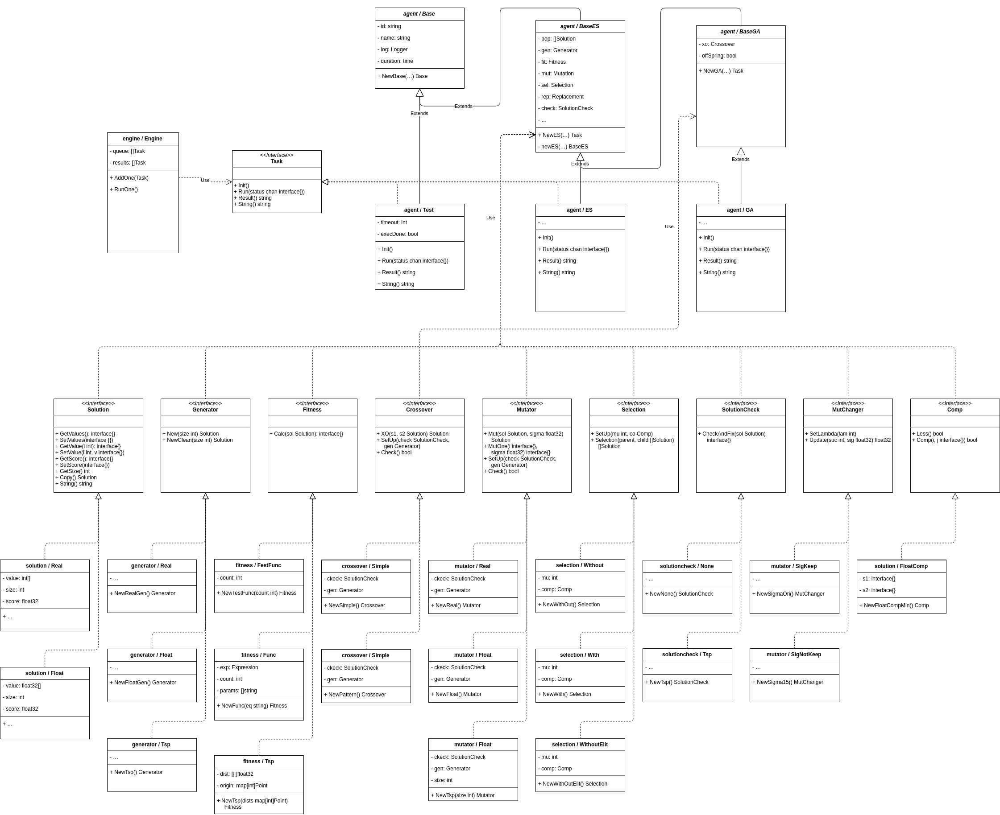

# GoGp
__Go Genetic Programming__ is a small extendable framework which is written in Go.

The different to other frameworks is, that everything can be changed.
Starting from the point that a Task is something that knows how to
execute the inner structure but does not know anything about it.
According to that, there must only be written some small parts to fit
into the desired problem domain.

There are two strategies implemented:
1. *Evolutionary Strategic (ES)*
2. *Genetic Algorithm (GA)*

What can be optimized from the current state:
* Function minimum value search
* Traveling Sales Man optimisation (TSP)

Thanks to [Kentic-govaluate](https://github.com/Knetic/govaluate),
there can be a function specified via an expression.
This function will be interpreted and evaluated at runtime.

## The Framework



## How to use the Framework

### Minimum value search

```go
// create an engine to execute tasks
e = *engine.New()

// create a funktion for evaluation
baseFunc := "x1 ** 2 + 1" // e.q. x^2 + 1

// setup an ES task
funcOpti := agent.NewES(10, 20, 100, 1,
                fitness.NewFunc(baseFunc), generator.NewFloatGen(),
                mutator.NewFloat(), selection.NewWithOut(), mutator.NewSigma15(),
                solutioncheck.NewNone(), solution.NewFloatCompMin())

// add the task to the engine
e.Add(funcOpti)

// tell the engine to run the first task in the internal queue
e.Run()
```

__ES Parameter__
```go
func NewES(mu, lambda, genCount, entitySize int,
    f iface.Fitness, g iface.Generator, m iface.Mutator,
    s iface.Selection, mc iface.MutChanger, c iface.SolutionCheck,
    comp iface.Comp) iface.Task {...}
```

* mu: Parent population size
* lambda: Children population size
* genCount: How many generations should be evaluated
* entitySize: How many values has one solution candidate
* f: Fitness-Function to calculate the score of each candidate
* g: Generator for creating new candidates
* m: Mutator which creates the mutated children
* s: Selection with or without parents or ...
* mc: Sigma-Controller for changes the mutation range over time
* c: Solution-Check for checking and fixing a candidate to be valid
* comp: Comparing operation for the score value to find for example the minimum

### Traveling Sales Man optimisation

```go
// create an engine to execute tasks or use the existing one
e = *engine.New()

// create a map of points with there location (x, y)
path := map[int]utils.Point{
        0:  {288, 149}, 1:  {288, 129}, 2:  {270, 133},
        3:  {256, 141}, 4:  {256, 157}, 5:  {246, 157},
        6:  {236, 169}, 7:  {228, 169}, 8:  {228, 161},
        9:  {220, 169}, 10: {212, 169}, 11: {204, 169},
        12: {196, 169}, 13: {188, 169}, 14: {196, 161},
        15: {188, 145}, 16: {172, 145}, 17: {164, 145},
        18: {156, 145}, 19: {148, 145},
}

// setup a GA task
tsp := agent.NewGA(10, 20, 200, 20, false,
            fitness.NewTsp(path), generator.NewTsp(), crossover.NewSimple(),
            mutator.NewTsp(20), selection.NewWithOut(), mutator.NewSigmaOri(),
            solutioncheck.NewTsp(), solution.NewFloatCompMin())

// add the task to the engine
e.Add(tsp)

// tell the engine to run the first task in the interal queue
e.Run()
```

__GA Parameter__
```go
func NewGA(mu, lambda, genCount, entitySize int, ofs bool,
    f iface.Fitness, g iface.Generator, xo iface.Crossover,
    m iface.Mutator, s iface.Selection, mc iface.MutChanger,
    c iface.SolutionCheck, comp iface.Comp) iface.Task {...}
```

* mu: Parent population size
* lambda: Children population size
* genCount: How many generations should be evaluated
* entitySize: How many values has one solution candidate
* ofs: Offspring-Selection means, should a child be succeed over it's parents be directly in the new population
* f: Fitness-Function to calculate the score of each candidate
* g: Generator for creating new candidates
* xo: Crossover for producing an offspring from two parents
* m: Mutator which creates the mutated children
* s: Selection with or without parents or ...
* mc: Sigma-Controller for changes the mutation range over time
* c: Solution-Check for checking and fixing a candidate to be valid
* comp: Comparing operation for the score value to find for example the minimum

## TODO

* [ ] Code documentation
* [ ] Code Tests
* [ ] Result and execution visualisation
* [ ] Impl. more mutation functions
* [ ] Impl. more crossover functions
* [ ] Impl. more selection functions